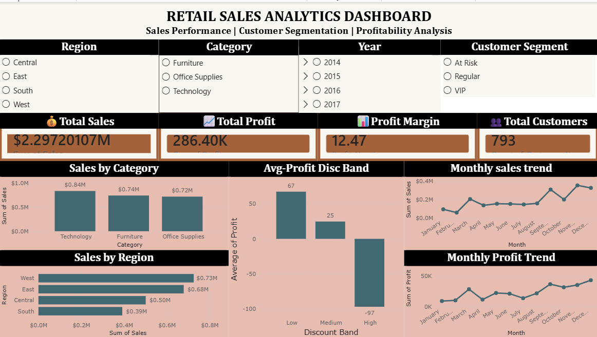

# 🛒 Retail Sales Analytics & Customer Segmentation


An end-to-end Retail Sales Analytics project that combines **Python**, **Pandas**, **RFM Customer Segmentation**, and an **interactive Power BI Dashboard** to analyze sales performance, customer behavior, and business profitability.

---

## 📌 Project Overview

This project analyzes retail sales data to uncover valuable business insights using Python for data cleaning and analysis, followed by an interactive Power BI dashboard for visualization.

The project demonstrates the complete analytics workflow:

- Data Cleaning
- Exploratory Data Analysis (EDA)
- Sales Performance Analysis
- Customer Segmentation (RFM Analysis)
- Business Insights
- Interactive Dashboard Development

---
## 📊 Dashboard Preview



## 🛠️ Tools & Technologies

- Python
- Pandas
- NumPy
- Matplotlib
- Jupyter Notebook
- Power BI
- Git & GitHub

---

## 📂 Repository Structure

```text
Retail-Sales-Analytics-and-Customer-Segmentation/
│
├── data/
│   ├── SampleSuperstore.csv
│   └── SampleSuperstore_Cleaned.csv
│
├── notebooks/
│   └── sales_analysis.ipynb
│
├── dashboard/
│   └── Retail_Sales_Dashboard.pbix
│
├── images/
│
├── reports/
│
├── README.md
├── LICENSE
└── .gitignore
```

---

## 📊 Project Workflow

1. Imported the retail sales dataset.
2. Cleaned and preprocessed the data.
3. Converted data types and handled formatting issues.
4. Performed Exploratory Data Analysis (EDA).
5. Analyzed:
   - Sales
   - Profit
   - Categories
   - Regions
   - Monthly Trends
6. Performed RFM Customer Segmentation.
7. Classified customers into:
   - VIP
   - Regular
   - At Risk
8. Built an interactive Power BI dashboard.

---

## 📈 Key Business Insights

- Technology generated the highest sales.
- The West region recorded the highest revenue.
- November was the best-performing month.
- Higher discounts were associated with lower profits.
- Most customers belong to the Regular segment.
- 202 customers were identified as At Risk.
- VIP customers contributed significantly despite being fewer in number.

---

## 📊 Dashboard Features

- KPI Cards
- Sales by Category
- Monthly Sales Trend
- Sales by Region
- Monthly Profit Trend
- Customer Segmentation
- Discount Analysis
- Interactive Filters

---

## 🚀 Future Improvements

- Sales Forecasting
- Customer Churn Prediction
- Product Recommendation System
- Advanced Power BI DAX Measures
- SQL Integration
- Machine Learning Models

---
## 💡 Skills Demonstrated

- Data Cleaning
- Data Wrangling
- Exploratory Data Analysis (EDA)
- Business Analytics
- Customer Segmentation (RFM)
- Data Visualization
- Dashboard Development
- Business Intelligence
- Power BI
- Python Programming

## 👨‍💻 Author

**Bhanu Pratap Sharma**

B.Tech Biotechnology, NIT Warangal

Interested in Data Analytics, Business Intelligence, and Data Science.
